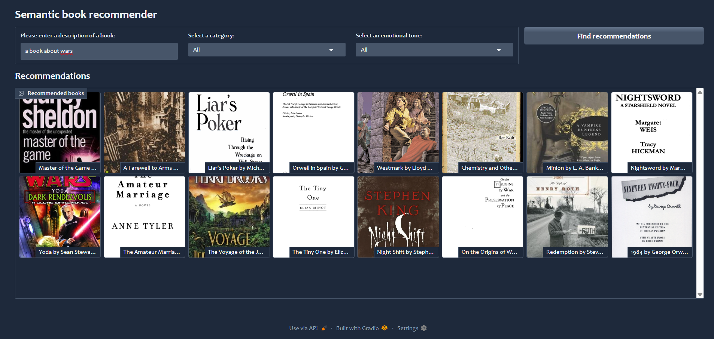

### Semantic Book Recommender System
A machine learning-based book recommendation system that leverages semantic search, text classification, and sentiment analysis to provide personalized book suggestions.


---
## Project Overview
This project aims to build a semantic book recommender that:

* Uses Jina Embeddings for vector search.

* Classifies books into categories using zero-shot learning (Facebook BART-large-MNLI).

* Extracts emotions from book descriptions (RoBERTa-based emotion classifier).

* Provides an interactive Gradio dashboard for users to search books by query, category, and emotion.

---
## Project Structure

```markdown
📦 SEMANTIC_BOOK_RECOMMENDER  
├── 📁 assets  
├── 📁 chroma_db   
├── 📁 dashboard  
├── 📄 gradio_dashboard.py           # 🖥️ Interactive recommendation UI  
├── 📁 data  
│   ├── 📄 books.csv                 # Raw book dataset  
│   ├── 📄 books_with_categories.csv # Books with predicted categories  
│   ├── 📄 books_with_emotions.csv   # Books with emotion labels  
│   ├── 📄 cleaned_data.csv          # Initial cleaned version  
│   └── 📄 cleaned_data_v2.csv       # Final cleaned data  
├── 📁 notebooks  
│   ├── 📄 EDA.ipynb                 # 🔍 Data exploration notebook  
│   ├── 📄 sentiment_analysis.ipynb  # 😊 Emotion detection  
│   ├── 📄 text_classification.ipynb # �♂️ Genre classification  
│   └── 📄 vector_search.ipynb       # 🔎 Semantic search setup  
├── 📁 plots  
│   ├── 📄 cols_vs_missing_vals.png  # 📊 Missing value analysis  
│   └── 📄 corr_matrix.png           # ↔️ Feature correlations between description & other cols  
├── 📁 text_files  
│   └── 📄 tagged_description.txt    # ISBN+description formatted text   
├── 📄 .gitignore  
├── 📄 Pipfile                      # 🐍 Python dependencies  
└── 📄 Pipfile.lock  
```
---
## Real World Applications
🏛️ **For Libraries & Bookstores**

- **Personalized Discovery**: Helps patrons find books by describing what they want in natural language
- **Inventory Enhancement**: Auto-tags uncategorized books with genres and moods
- **Themed Displays**: Quickly assemble collections by emotion (e.g., "Feel-Good Reads")

📱 **For Digital Platforms**

- **E-commerce Integration**: Powers "You Might Like" sections on book retail sites
- **Book Subscription Services**: Curates personalized monthly picks based on mood preferences
- **Reading Apps**: Suggests next reads by understanding reading history context

